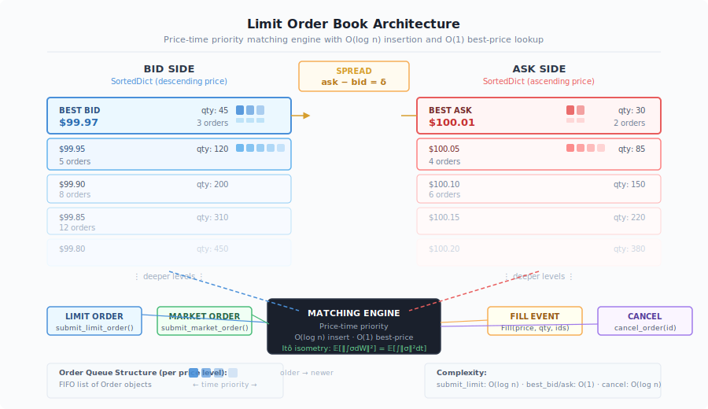
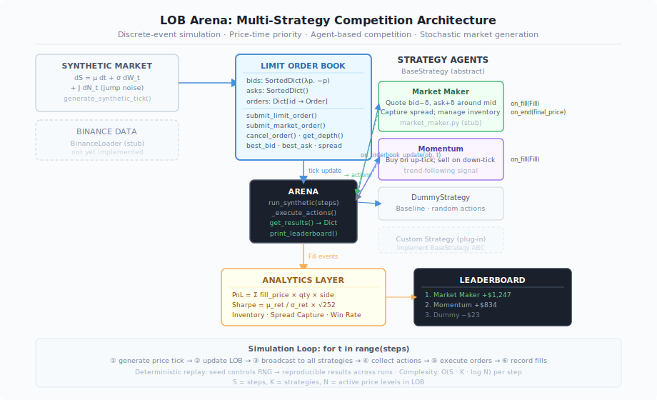

<div align="center">

# LOB Arena — Limit Order Book Simulation Framework

**A production-grade, price-time priority limit order book with multi-strategy competition and discrete-event simulation — built from first principles.**

[](https://python.org)
[](LICENSE)
[]()

*Author: HongJin HE (何泓锦) · HKUST AI · Stanford Exchange 2026*

</div>

---

## Overview

LOB Arena implements the complete matching engine at the heart of every electronic exchange — from NYSE and HKEX to crypto venues like Binance. The core module (`lob_arena/`) provides a self-contained, mathematically precise limit order book with:

- **Price-time priority matching** — the universal exchange rule: best price wins; among equal prices, earlier submission wins
- **O(log n) insertion, O(1) best-price lookup** — via dual `SortedDict` structures (bids descending, asks ascending)
- **Multi-strategy Arena** — run K competing strategies simultaneously against the same synthetic market, record all fills, rank by PnL
- **Discrete-event simulation** — tick-by-tick replay with deterministic RNG seeding for reproducible experiments

---

## Architecture

### Figure 1 — Limit Order Book Structure



The LOB maintains two independent sorted data structures:

| Side | Container | Ordering | Best-price access |
|------|-----------|----------|-------------------|
| **Bids** | `SortedDict(key=λp: −p)` | Descending (highest first) | `bids.peekitem(0)` → O(1) |
| **Asks** | `SortedDict()` | Ascending (lowest first) | `asks.peekitem(0)` → O(1) |

Each price level maps to a FIFO queue of `Order` objects. Time priority within a level is enforced by insertion order.

### Figure 2 — Arena Multi-Strategy Architecture



The Arena executes a discrete event loop:

```
for t in range(steps):
    tick  ← generate_synthetic_tick()   # dS = μ dt + σ dW_t + J dN_t
    LOB   ← update_book(tick)
    for strategy in strategies:
        actions ← strategy.on_orderbook_update(LOB, t)
        for action in actions:
            fills ← LOB.execute(action)
            strategy.on_fill(fills)
for strategy in strategies:
    strategy.on_end(final_price)        # compute realized PnL
```

Complexity per step: **O(S · K · log N)** where S = steps, K = active strategies, N = distinct price levels.

---

## Mathematical Foundations

### 1. Matching Algorithm — Formal Specification

Let $\mathcal{B} = \{(p_i, q_i, t_i)\}$ be the bid side (price-time pairs) and $\mathcal{A} = \{(p_j, q_j, t_j)\}$ the ask side. An incoming limit order $(p^*, q^*, \text{BUY})$ matches if:

$$\exists\, (p_j, q_j, t_j) \in \mathcal{A} \;\text{ s.t. }\; p_j \leq p^*$$

Fills are generated greedily from the best available price:

$$\text{fill}_k = \left(p_k,\; \min(q_{\text{remaining}},\, q_k)\right), \quad k = \arg\min_{j} p_j$$

The process repeats, consuming liquidity level by level (and within each level, order by order in arrival sequence), until either $q^*$ is exhausted or no more matching levels exist. Unmatched residual is posted to the book.

Market orders ($p^* = \pm\infty$) walk the entire book until filled or book is empty.

### 2. Spread and Mid-Price

$$\text{spread} \;\triangleq\; p^{\text{ask}}_{\text{best}} - p^{\text{bid}}_{\text{best}} \geq 0$$

$$\text{mid} \;\triangleq\; \frac{p^{\text{ask}}_{\text{best}} + p^{\text{bid}}_{\text{best}}}{2}$$

A market maker's theoretical edge per round-trip: $\frac{1}{2}\,\delta$ per side (half-spread capture), contingent on inventory neutrality.

### 3. Synthetic Market Generation

The Arena's synthetic price process follows a discretized jump-diffusion:

$$S_{t+\Delta} = S_t \exp\!\left(\mu\,\Delta t + \sigma\,\sqrt{\Delta t}\,\varepsilon_t + J_t\,\mathbf{1}_{N_t > 0}\right)$$

where:
- $\varepsilon_t \sim \mathcal{N}(0,1)$ — Brownian innovation (physical volatility)
- $N_t \sim \text{Poisson}(\lambda\,\Delta t)$ — jump arrival count
- $J_t \sim \mathcal{N}(\mu_J, \sigma_J^2)$ — jump magnitude (behavioral noise, Lévy component)

This decomposition corresponds to the **Lévy-Itô** structure used in the companion paper [Mathematical Framework for World Models in Quant Finance](https://github.com/hongjin-he/mathmatical-framework-for-world-models-in-quant-finance).

### 4. Strategy Performance Metrics

**Realized PnL** for strategy $k$ at terminal time $T$:

$$\text{PnL}_k = \sum_{i=1}^{N_{\text{fills}}} \text{fill}_i.\text{price} \times \text{fill}_i.\text{qty} \times \text{sign}(\text{fill}_i.\text{side}) + S_T \times \text{inventory}_k$$

where inventory $= \sum_i \text{fill}_i.\text{qty} \times \mathbf{1}[\text{fill}_i \text{ is BUY}] - \sum_i \text{fill}_i.\text{qty} \times \mathbf{1}[\text{fill}_i \text{ is SELL}]$.

**Sharpe Ratio** (annualized):

$$\text{SR} = \frac{\mathbb{E}[r_t]}{\sqrt{\text{Var}(r_t)}} \cdot \sqrt{252 / \Delta t}$$

where $r_t = \text{PnL}_t - \text{PnL}_{t-1}$ is the per-step return.

---

## Codebase Reference

### Directory Structure

```
lob_arena/
├── core/
│   └── orderbook.py          # OrderBook, Order, Fill — fully implemented
├── strategies/
│   ├── base.py               # BaseStrategy ABC — fully implemented
│   ├── market_maker.py       # Stub (extend BaseStrategy here)
│   └── lob_arena/arena.py    # Arena simulation engine — fully implemented
├── analytics/
│   └── metrics.py            # Stub (PnL / Sharpe calculators)
├── data/
│   └── binance_loader.py     # Stub (real tick data ingestion)
├── viz/
│   └── replay.py             # Stub (Plotly replay)
└── examples/
    ├── arena_test.py
    └── replay_spread.py
```

### `OrderBook` — Complete API

```python
class OrderBook:
    def __init__(self, tick_size: float = 0.01)
```

| Method | Signature | Returns | Complexity |
|--------|-----------|---------|------------|
| `submit_limit_order` | `(side, price, quantity, trader_id)` | `Tuple[int, List[Fill]]` | O(log n) |
| `submit_market_order` | `(side, quantity, trader_id)` | `List[Fill]` | O(k log n) |
| `cancel_order` | `(order_id: int)` | `bool` | O(log n) |
| `get_depth` | `(levels: int = 5)` | `Dict[str, List]` | O(levels) |
| `get_snapshot` | `()` | `Dict` | O(n) |
| `best_bid` | property | `Optional[float]` | O(1) |
| `best_ask` | property | `Optional[float]` | O(1) |
| `spread` | property | `Optional[float]` | O(1) |

#### Internal `_match` algorithm

```python
def _match(self, incoming: Order) -> List[Fill]:
    opposite = self._asks if incoming.side == 'BUY' else self._bids
    fills = []
    while incoming.quantity > 0 and opposite:
        best_price, queue = opposite.peekitem(0)          # O(1)
        if not self._price_matches(incoming, best_price):
            break
        while queue and incoming.quantity > 0:
            resting = queue[0]
            fill_qty = min(incoming.quantity, resting.quantity)
            fills.append(Fill(best_price, fill_qty, incoming.id, resting.id))
            # decrement quantities, remove exhausted orders
            ...
        if not queue:
            del opposite[best_price]                       # O(log n)
    return fills
```

#### `Order` and `Fill` data structures

```python
@dataclass
class Order:
    id: int                 # auto-incremented
    side: str               # 'BUY' | 'SELL'
    price: float            # None for market orders
    quantity: float
    trader_id: str
    timestamp: float        # time.time() at submission

@dataclass
class Fill:
    price: float
    quantity: float
    buyer_order_id: int
    seller_order_id: int
```

---

### `BaseStrategy` — Strategy Interface

```python
from abc import ABC, abstractmethod

class BaseStrategy(ABC):
    def __init__(self, trader_id: str):
        self.trader_id = trader_id
        self.inventory: float = 0.0
        self.cash: float = 0.0
        self.trades: List[Fill] = []

    @abstractmethod
    def on_orderbook_update(
        self,
        ob: OrderBook,
        timestamp: float
    ) -> List[Dict]:
        """
        Called every tick. Return a list of action dicts:
          {'type': 'limit',  'side': 'BUY'|'SELL', 'price': float, 'qty': float}
          {'type': 'market', 'side': 'BUY'|'SELL', 'qty': float}
          {'type': 'cancel', 'order_id': int}
        """
        ...

    def on_fill(self, fill: Fill) -> None:
        """Update inventory and cash on fill."""
        ...

    def on_end(self, final_price: float) -> None:
        """Mark inventory to market at final_price, compute terminal PnL."""
        ...
```

#### Implementing a custom strategy

```python
from lob_arena.strategies.base import BaseStrategy

class MyStrategy(BaseStrategy):
    def on_orderbook_update(self, ob, timestamp):
        mid = (ob.best_bid + ob.best_ask) / 2
        spread = ob.spread or 0.02
        return [
            {'type': 'limit', 'side': 'BUY',  'price': mid - spread/4, 'qty': 10},
            {'type': 'limit', 'side': 'SELL', 'price': mid + spread/4, 'qty': 10},
        ]
```

---

### `Arena` — Simulation Engine

```python
class Arena:
    def __init__(self, strategies: List[BaseStrategy], tick_size: float = 0.01)

    def run_synthetic(
        self,
        steps: int = 1000,
        initial_price: float = 100.0,
        mu: float = 0.0,
        sigma: float = 0.02,
        seed: Optional[int] = None
    ) -> None

    def get_results(self) -> Dict[str, Dict]:
        """Returns {trader_id: {pnl, trades, inventory, sharpe}}"""

    def print_leaderboard(self) -> None
```

#### Running a competition

```python
from lob_arena.strategies.lob_arena.arena import Arena
from lob_arena.strategies.base import DummyStrategy

strategies = [
    MyStrategy("mm_v1"),
    DummyStrategy("baseline"),
]

arena = Arena(strategies)
arena.run_synthetic(steps=5000, initial_price=100.0, sigma=0.02, seed=42)
arena.print_leaderboard()

results = arena.get_results()
# → {"mm_v1": {"pnl": 1247.3, "trades": 843, "inventory": 2, "sharpe": 1.84},
#    "baseline": {"pnl": -23.1, ...}}
```

---

## Quick Start

```bash
git clone https://github.com/hongjin-he/quant-realtime-backtest-framework.git
cd quant-realtime-backtest-framework
pip install -e .
python -m lob_arena.cli battle --strategies mm,momentum --steps 10000
```

### Standalone LOB usage

```python
from lob_arena.core.orderbook import OrderBook

ob = OrderBook(tick_size=0.01)

# Post resting liquidity
order_id, fills = ob.submit_limit_order('BUY',  price=99.95, quantity=100, trader_id='lp_1')
order_id, fills = ob.submit_limit_order('SELL', price=100.05, quantity=80,  trader_id='lp_2')

print(ob.best_bid)   # 99.95
print(ob.best_ask)   # 100.05
print(ob.spread)     # 0.10
print(ob.get_depth(levels=3))

# Aggressive market order — matches against best ask
fills = ob.submit_market_order('BUY', quantity=50, trader_id='taker_1')
# → [Fill(price=100.05, quantity=50, buyer_order_id=..., seller_order_id=...)]
```

---

## Design Decisions

### Why `SortedDict` over a heap or B-tree?

Python's `sortedcontainers.SortedDict` provides:

- `O(log n)` insert/delete (B-tree internally, pure Python)
- `O(1)` min/max via `peekitem(0)` / `peekitem(-1)`
- `O(log n)` arbitrary key deletion by `order_id` — critical for cancel

A `heapq` would give O(log n) push/pop but requires lazy deletion markers (messy) and has no efficient arbitrary-key cancel. A raw `dict` gives O(1) lookup but loses sorted iteration needed for depth snapshots.

### Why not a red-black tree in C?

For research and strategy development at the scales we target (< 10⁶ orders/run), pure Python SortedDict is fast enough and far more debuggable. Production HFT uses C++ intrusive linked lists with pointer arithmetic — that's a different tradeoff surface.

### Why discrete-event, not continuous time?

Discrete-event simulation gives exact reproducibility: fix `seed`, get identical fills every run. This makes strategy debugging tractable. A continuous-time simulator (queuing network model) is more realistic but non-deterministic without careful RNG control.

---

## Roadmap

| Module | Status | Description |
|--------|--------|-------------|
| `core/orderbook.py` | **Complete** | Price-time priority LOB, full API |
| `strategies/base.py` | **Complete** | Strategy ABC + fill/inventory tracking |
| `arena.py` | **Complete** | Multi-strategy simulation loop |
| `strategies/market_maker.py` | Stub | Avellaneda-Stoikov market making |
| `analytics/metrics.py` | Stub | Sharpe, Sortino, max-DD, IC |
| `viz/replay.py` | Stub | Plotly tick-by-tick replay |
| `data/binance_loader.py` | Stub | Real tick data ingestion |

---

## Related Work

- **[diffusion-alpha-mining](https://github.com/hongjin-he/diffusion-alpha-mining)** — applying diffusion models / flow matching to systematic alpha factor discovery
- **[Mathematical Framework for World Models in Quant Finance](https://github.com/hongjin-he/mathmatical-framework-for-world-models-in-quant-finance)** — theoretical foundations: Lévy-Itô decomposition, Mean-Field Games, McKean-Vlasov SDEs
- Avellaneda & Stoikov (2008) — *High-frequency trading in a limit order book* (the canonical MM paper)
- Cont, Stoikov & Talreja (2010) — *A stochastic model for order book dynamics*

---

## Citation

```bibtex
@software{he2025lobArena,
  author  = {He, Hongjin},
  title   = {LOB Arena: Limit Order Book Simulation Framework},
  year    = {2025},
  url     = {https://github.com/hongjin-he/quant-realtime-backtest-framework}
}
```

---

<div align="center">
<sub>MIT License · HKUST AI · 2025–2026</sub>
</div>
