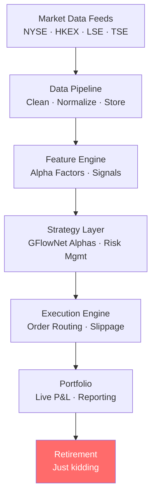
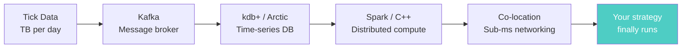

<div align="center">

# Quant Realtime Backtest Framework

**An ambitious attempt to build a global stock trading platform — and what it taught me about the gap between theory and reality.**

[](LICENSE)
[](https://python.org)
[]()


*This is what running a backtest feels like. The reality of what's happening underneath is considerably less clean.*

</div>

---

## What This Was Supposed to Be

As a first-year university student with a background in quantitative reasoning and a deep interest in financial markets, I set out to build a **production-grade, real-time global stock trading platform** from scratch.

The vision:



Multi-market, multi-asset, real-time backtesting and strategy evaluation. Comparable to what Renaissance Technologies runs internally.

I gave myself one semester.

---

## Why It Failed (The Honest Post-Mortem)

### Wall #1 — Data is the actual business

Getting clean, normalized, survivorship-bias-free historical data for *one* market (let alone global) costs **tens of thousands of dollars per year**:

| Data Source | Annual Cost |
|-------------|------------|
| Refinitiv Tick History | ~$50K+ |
| Bloomberg Terminal | ~$20K/seat |
| Nasdaq TotalView | ~$10K+ |
| Yahoo Finance (free) | Gaps everywhere, errors weekly |

I spent more time cleaning Yahoo Finance data than building any actual infrastructure.

### Wall #2 — Infrastructure at scale is a full-time job

Processing tick data for thousands of instruments across multiple exchanges:



This pipeline alone is a full-time job for a team of senior engineers. I had a laptop.

### Wall #3 — The textbook-to-production gap

Every quantitative finance textbook teaches you Sharpe ratios, factor models, and Black-Scholes. None prepare you for:

- Survivorship bias making backtests look 40% better than reality
- Transaction cost modeling that actually reflects market impact
- Regime changes that invalidate last year's strategy parameters
- The difference between IC=0.15 in a backtest and IC=0.03 in production

---

## What Got Built

The `lob_arena/` module — a working Limit Order Book simulator. The one component I managed to complete:

```
lob_arena/
├── core/          # Order book matching engine
├── strategies/    # Basic MM and momentum strategies
├── analytics/     # PnL, Sharpe, spread capture metrics
├── data/          # Binance tick data ingestion stubs
└── viz/           # Plotly replay visualization
```

```bash
pip install -e .
python -m lob_arena.cli battle --strategies mm,momentum --steps 10000
```

---

## What I Learned

> The gap between knowing finance and building finance infrastructure is enormous — and most of that gap is filled with money, time, and engineering headcount that a first-year student simply does not have.

1. **Data quality is 80% of the problem.** No model survives contact with real, dirty market data.
2. **Backtesting is easier than it looks, and harder than it seems.** Overfitting to history is trivially easy.
3. **Start smaller.** A robust single-strategy, single-asset backtester > a broken multi-market platform.
4. **Institutional infrastructure took decades to build.** Replicating it solo in a semester was never realistic.

---

## What Comes Next

This project is archived. The lessons directly informed:

- [GFlowNet-Alpha-Mining](https://github.com/hongjin-he/GFlowNet-Alpha-Mining) — focused, theory-grounded approach to alpha generation
- [mathmatical-framework-for-world-models-in-quant-finance](https://github.com/hongjin-he/mathmatical-framework-for-world-models-in-quant-finance) — the mathematical foundations I wish I had before starting this

---

## For Anyone Who Finds This

If you're a student who tried to build something too big and ran into the same walls — you're not alone. The LOB simulator code works. Use it.

---

<div align="center">
<sub>Built (and abandoned) by a first-year university student who learned the hard way · HKUST · 2025</sub>
</div>
